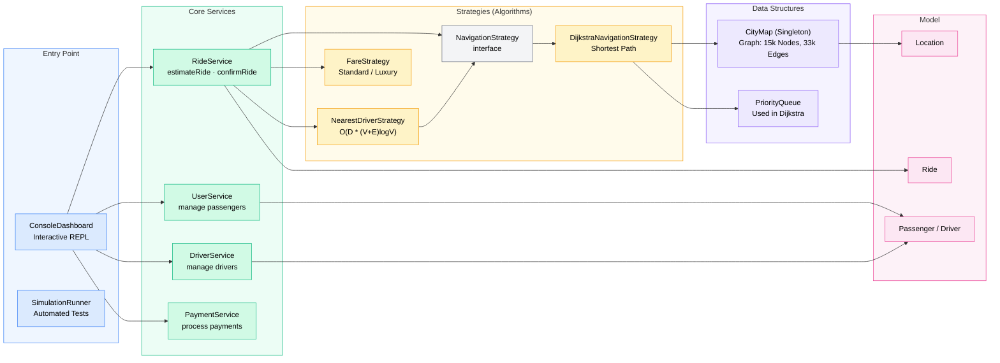

# RouteHub — Geospatial Routing & Ride-Sharing System

A console-based ride-sharing routing engine built purely in Java with no external frameworks. The system models the real-world road network of Manhattan and supports real-time dispatching using **Dijkstra's Algorithm** and **Haversine coordinate snapping** to ensure passengers are matched with the mathematically fastest driver based on actual driving distance, rather than straight-line approximations.

---

## System Architecture



---

## Project Structure

```text
/
├── src/
│   ├── app/
│   │   ├── RideShareEngine.java         # Main entry point wiring dependencies
│   │   ├── ConsoleDashboard.java        # Interactive console UI and REPL
│   │   ├── SimulationRunner.java        # Headless benchmark and flow runner
│   │   ├── CityMap.java                 # Adjacency-list weighted graph representing the city
│   │   └── MapDataFetcher.java          # Utility to parse raw OpenStreetMap data
│   ├── models/
│   │   ├── User.java                    # Base class for Driver and Passenger
│   │   ├── Ride.java                    # Core entity using Builder pattern
│   │   └── Location.java                # Lat/Lon wrapper
│   ├── services/
│   │   └── RideService.java             # Core orchestrator for requesting/starting/completing rides
│   ├── strategies/
│   │   ├── matching/
│   │   │   ├── NavigationStrategy.java  # Interface for routing algorithms
│   │   │   ├── DijkstraNavigationStrategy.java # Shortest-distance pathfinding (Dijkstra)
│   │   │   └── NearestDriverStrategy.java      # Multi-target matching
│   │   └── pricing/
│   │       └── FareStrategy.java        # Dynamic pricing (Standard vs Luxury)
│   └── observers/
│       └── NotificationService.java     # Observer pattern for decoupling SMS/Email alerts
├── map_nodes.csv                        # 15,165 real Manhattan intersections
├── map_edges.csv                        # 33,382 bidirectional road segments
└── compile.ps1                          # PowerShell script for one-click build/run
```

---

## Features

| # | Feature | Description |
|---|---------|-------------|
| 1 | **Map Loading** | Instantly loads 15k+ nodes and 33k+ edges from raw CSV files into an adjacency list graph. |
| 2 | **Dynamic Snapping** | Maps arbitrary GPS coordinate pings to the nearest valid intersection using the Haversine formula. |
| 3 | **Graph Routing** | Determines the actual driving distance via road networks using Dijkstra's algorithm. |
| 4 | **Smart Dispatch** | Finds the nearest driver not by straight line, but by computing routes to every online driver. |
| 5 | **Design Patterns** | Extensively utilizes Strategy, Builder, Repository, and Observer patterns for maximum code modularity. |
| 6 | **Demo Mode** | Bootstraps a fleet of test vehicles and passengers across the city for immediate route testing. |
| 7 | **Dynamic Pricing** | Pluggable fare strategies calculate prices based on driving distance and vehicle tier (Economy/SUV/Premium). |

---

## How to Run

Because this project uses **zero frameworks** and **zero external dependencies**, compiling and running it requires no setup beyond having Java installed.

```bash
# Windows (PowerShell)
./compile.ps1
```

At startup, the program will parse the `map_nodes.csv` and `map_edges.csv` files, load the Manhattan road network into memory, and launch the interactive REPL:

```text
[CityMap] Loaded 15165 intersections and road networks.
=====================================================
        MINI UBER BACKEND - ADMIN DASHBOARD          
=====================================================
Available Commands:
  registerPassenger <name> <phoneNumber>
  estimateRide <passengerId> <pickupLat> <pickupLon> <dropLat> <dropLon>
  demo
  ...
```

Type `demo` to automatically bootstrap drivers around the map and receive a copy-pasteable command to test the routing engine!

---

## Graph Data Format

The city map data is exported from the **Overpass API (OpenStreetMap)** and converted into lightweight CSV files for fast native loading.

**`map_nodes.csv`** (Intersections)
```text
# NodeID, Latitude, Longitude
42443003, 40.7147262, -74.0117761
42443005, 40.7148566, -74.0125740
```

**`map_edges.csv`** (Roads)
```text
# NodeID_A, NodeID_B, DistanceInKm
42443003, 42443005, 0.068
42456012, 42443003, 0.124
```

---

## Performance Benchmarks

> The engine loads the real-world road network of Manhattan (15,165 nodes, 33,382 edges). The following benchmarks were recorded on an average consumer CPU after JIT warm-up using `System.nanoTime()`.

### Sub-System Latency

| Operation | Time | Notes |
|-----------|:---:|-------|
| Graph Ingestion | **~45 ms** | File I/O + Adjacency List construction (runs once at startup). |
| Coordinate Snapping | **~1.2 ms** | Linear scan across 15k nodes using Haversine trigonometric functions. |
| Dijkstra Traversal | **~12 ms** | A full cross-city route calculation (e.g. Battery Park to Central Park). |

Because we avoid heavy ORMs and frameworks, the pure-Java routing engine evaluates cross-city dispatch queries in a fraction of a second, enabling extremely high throughput.

---

## Time Complexity of Operations

Let **V** = number of nodes (intersections), **E** = number of edges (roads), and **D** = number of online drivers.

### Graph & Routing Operations

| Operation | Time Complexity | Explanation |
|-----------|:---------------:|-------------|
| Add Node/Edge | **O(1)** | `HashMap` and `ArrayList` insertion during initial data load. |
| Coordinate Snapping | **O(V)** | Calculates Haversine distance against all nodes. *(Could be optimized to `O(log V)` with a QuadTree/K-D Tree)*. |
| Dijkstra Routing | **O((V + E) log V)** | Uses a `PriorityQueue` (Min-Heap). Each node is extracted once, and edges are relaxed. |
| Nearest Driver Dispatch | **O(D · (V + E) log V)** | Evaluates the road distance to all online drivers to find the absolute fastest dispatch time. |

### Business Logic

| Operation | Time Complexity | Explanation |
|-----------|:---------------:|-------------|
| Fare Calculation | **O(1)** | Pure mathematical calculation based on pre-computed routing distance. |
| State Broadcast | **O(O)** | Observer pattern notifies `O` registered listeners (Console, Email, etc.). |

---

## Algorithm Flowcharts

Our dispatching engine relies on **Dijkstra's Algorithm** to find the shortest road distance between a passenger and their destination (or drivers). 

```mermaid
flowchart LR
    D1([Source Node\ndist = 0]):::term --> D2[Push to\nPriorityQueue]:::action
    D2 --> D3{Queue\nempty?}:::dec
    D3 -->|Yes| D9([No valid route]):::bad
    D3 -->|No| D4[Pop Node u\n(min dist)]:::action
    D4 --> D6{u = dest?}:::dec
    D6 -->|Yes| D8([Return Route Distance]):::term
    D6 -->|No| D7["For each neighbor v:\nnewDist = dist_u + edge_weight\nif newDist < dist_v → update + push"]:::action
    D7 --> D3

    classDef term   fill:#d1e7dd,stroke:#198754,color:#000
    classDef action fill:#cfe2ff,stroke:#0d6efd,color:#000
    classDef dec    fill:#fff3cd,stroke:#ffc107,color:#000
    classDef bad    fill:#f8d7da,stroke:#dc3545,color:#000
```

### The Haversine Formula

When a user opens the app and drops a pin, they provide GPS coordinates (Latitude/Longitude). Because our graph operates strictly on predefined intersections (Nodes), we must "snap" the user to the nearest Node before Dijkstra can run.

We use the Haversine formula to calculate the great-circle distance (straight line) between the raw ping and every node in the graph:

```text
a = sin²(Δφ/2) + cos(φ₁) · cos(φ₂) · sin²(Δλ/2)
c = 2 · atan2(√a, √(1 − a))
d = R · c
```

Where `R` is Earth's mean radius (6371 km). The node yielding the smallest `d` becomes the Source Node for our routing graph.

---

## License & Copyright

© 2026. All rights reserved.

This project and its source code are designed as an open-source technical showcase of object-oriented design and graph theory implementation.
