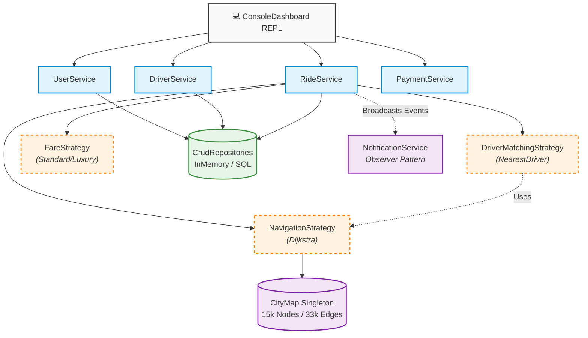

# 🚗 RouteHub: Algorithmic Ride-Sharing Backend

Welcome to **RouteHub**! 

Most ride-sharing clones just draw a straight line between Point A and Point B. **RouteHub is different.** 

This is a pure-Java backend engine built from the ground up to handle **real-world graph routing** and robust system design. It loads actual geographical data of Manhattan, maps it into a graph of over 15,000 intersections, and uses **Dijkstra's Algorithm** to dispatch the truly fastest driver to a passenger's location based on actual road networks.

Built with **Zero Frameworks** and **Zero External Libraries**, RouteHub is a showcase of raw algorithmic problem solving, Clean Architecture, and SOLID principles.

---

## ⚡ Core Technical Achievements

### 1. Real-World Graph Routing (Dijkstra + Haversine)
- **Map Ingestion:** The engine natively loads OpenStreetMap (Overpass API) data containing **15,165 nodes** and **33,382 road edges** representing the streets of Manhattan.
- **Coordinate Snapping:** When a user requests a ride from a random GPS coordinate, the engine uses the **Haversine Formula** to scan the graph and "snap" their location to the nearest valid road intersection.
- **Algorithmic Dispatching:** Finding the closest driver isn't just about straight-line distance. The `NearestDriverStrategy` executes **Dijkstra's Shortest Path Algorithm** using a `PriorityQueue` to calculate the actual road-time required for every online driver to reach the passenger, guaranteeing the dispatch of the mathematically fastest car.

### 2. Enterprise-Grade System Architecture
The codebase strictly adheres to **SOLID Principles** and leverages industry-standard **Design Patterns** to ensure it is highly scalable and maintainable:
- **Strategy Pattern:** Pricing (`FareStrategy`) and routing algorithms (`NavigationStrategy`) are decoupled. Want to switch from Standard Pricing to Surge Pricing, or from Dijkstra to A* Search? Just swap the strategy object at runtime.
- **Repository Pattern:** All data access is abstracted behind `CrudRepository` interfaces, allowing the backend to seamlessly transition from in-memory lists to a real SQL database in the future without changing business logic.
- **Observer Pattern:** A `NotificationService` actively listens to the `RideService` to broadcast state changes (e.g., "Ride Started", "Payment Processed") via Console/Email/SMS without tightly coupling the systems.
- **Builder Pattern:** Complex `Ride` objects are safely constructed using immutable builders.

### 3. Interactive REPL Dashboard
RouteHub features a custom-built, interactive Command-Line Interface (CLI) that acts as an Admin Dashboard. It parses user input dynamically and provides a seamless "copy-paste" UX for stepping through a complete ride lifecycle (from request, to dispatch, to payment).

---

## ⏱ Algorithmic Time Complexity
RouteHub is designed to be highly efficient, treating the city as a massive mathematical graph where $V$ is the number of intersections (Nodes) and $E$ is the number of road segments (Edges).

| Operation | Algorithm Used | Time Complexity | Description |
| :--- | :--- | :--- | :--- |
| **Graph Initialization** | Adjacency List Parsing | `O(V + E)` | Reads the raw CSV data into memory and constructs the HashMap-based graph. |
| **Coordinate Snapping** | Linear Search (Haversine) | `O(V)` | Scans all `15,000+` nodes to find the closest valid street intersection to a raw GPS ping. *(Can be optimized to `O(log V)` using a QuadTree).* |
| **Estimate Routing** | Dijkstra's Shortest Path | `O((V + E) log V)` | Uses a `PriorityQueue` (Min-Heap) to calculate the shortest mathematical path between the pickup and dropoff nodes. |
| **Dispatch Nearest Driver**| Multi-Target Dijkstra | `O(D * ((V + E) log V))`| Calculates the exact driving time from the passenger to every online driver ($D$), rather than relying on inaccurate straight-line distance, to guarantee the fastest pickup. |

---

## 🏗 System Architecture Diagram

RouteHub was built from the ground up using **SOLID Principles**. This diagram illustrates the strict decoupling between the Presentation Layer (CLI), the Core Services, and the highly modular Strategy/Repository implementations.



---

## 🚀 How to Run the Project

Since RouteHub relies on zero external dependencies, running it is incredibly easy.

### Prerequisites
- Java (JDK 8 or higher)
- A terminal (PowerShell, Bash, Command Prompt)

### Booting the Engine
1. Clone the repository and navigate to the root directory.
2. Compile and launch the application using the included script:
   ```bash
   ./compile.ps1
   ```
3. You will be greeted by the `Admin>` prompt and a confirmation that the 15,000-node graph was successfully loaded into memory.

### Running the Interactive Demo
Don't want to type out UUIDs and GPS coordinates manually? Just type `demo`!

```text
Admin> demo
```

The system will automatically:
1. Register a test Passenger.
2. Register 3 different Drivers (Economy, SUV, Premium).
3. Distribute those drivers across different real-world coordinates in the Manhattan bounding box and set them `ONLINE`.
4. Generate the exact `estimateRide` command for you to copy and paste to test the Dijkstra routing engine instantly.

From there, simply follow the on-screen prompts. The console will tell you exactly what command to copy and paste next to progress the ride through its lifecycle (`estimateRide` -> `confirmRide` -> `startRide` -> `completeRide` -> `rateAndPay`).

---

## 📂 Project Structure

```text
src/
├── app/                  # Main entry point and Dashboard REPL
├── exceptions/           # Custom domain exceptions (e.g., RideNotFoundException)
├── models/               # Core entities (Passenger, Driver, Ride, Location)
├── observers/            # Notification system implementations
├── repositories/         # Data persistence layer
├── services/             # Core business logic orchestrators
└── strategies/           # Interchangeable algorithms (Pricing, Matching, Routing)
map_nodes.csv             # 15,000+ Manhattan road intersections (Latitude/Longitude)
map_edges.csv             # 33,000+ road connections
```

---

## 🧠 Future Roadmap
- **Multithreading:** Implement a concurrency model to simulate 100+ passengers booking simultaneously, demonstrating thread safety with `ReentrantLocks`.
- **A* Pathfinding:** Introduce an A* Search `NavigationStrategy` using a heuristic function to optimize the graph traversal even further. 
- **Database Integration:** Swap the `InMemoryRepositories` with `SQLRepositories` using JDBC.

*Designed and engineered as a showcase of algorithmic efficiency and software design.*
