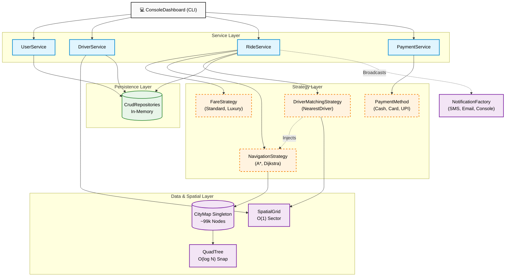

# 🚗 RouteHub: Algorithmic Ride-Sharing Backend

Welcome to **RouteHub**! 

Most ride-sharing clones just draw a straight line between Point A and Point B. **RouteHub is different.** 

This is a pure-Java backend engine built from the ground up to handle **real-world graph routing** and robust system design. It loads actual geographical data of New Delhi, maps it into a graph of over 99,000 intersections, and uses **A* and Dijkstra's Algorithms** to dispatch the truly fastest driver to a passenger's location based on actual road networks.

Built with **Zero Frameworks** and **Zero External Libraries**, RouteHub is a showcase of raw algorithmic problem solving, Clean Architecture, and SOLID principles.

---

## 🏗 System Architecture Diagram

RouteHub was built from the ground up using **SOLID Principles**. This diagram illustrates the strict decoupling between the Presentation Layer (CLI), the Core Services, the Spatial Data Structures, and the highly modular Strategy implementations.



---

## 📂 Project Structure

```text
/
├── bin/                  # Compiled .class files
├── src/                  # Java Source Code
│   ├── app/              # Main entry point, Data Fetcher, and REPL Dashboard
│   ├── exceptions/       # Custom domain exceptions
│   ├── factories/        # Factory patterns for instantiation
│   ├── models/           # Core entities (Passenger, Driver, Ride, Location)
│   │   └── enums/        # State enums (RideStatus, VehicleType)
│   ├── observers/        # Notification system implementations
│   ├── repositories/     # Data persistence interfaces and In-Memory implementations
│   ├── services/         # Core business logic orchestrators
│   ├── strategies/       # Interchangeable algorithms (Pricing, Matching, Routing)
│   ├── tests/            # Algorithmic Benchmark testing scripts
│   └── utils/            # SpatialGrid, QuadTree, Math Utilities
├── .gitignore            # Git ignore configuration
├── compile.ps1           # PowerShell build script
├── run.bat               # Windows execution script
├── map_nodes.csv         # ~99,000 New Delhi road intersections
└── map_edges.csv         # Road connections
```

## ⏱ Time Complexity of Operations
Let $V$ = number of nodes (intersections) and $E$ = number of edges (roads).

### Graph Operations
| Operation | Time Complexity | Explanation |
| :--- | :--- | :--- |
| **Add Node** | `O(1)` | Direct HashMap insertion during data parsing. |
| **Add Edge** | `O(1)` | Instantly appends connection to the Adjacency List. |
| **Get Neighbors**| `O(1)` | Direct HashMap lookup for adjacent nodes. |
| **Get Node by ID**| `O(1)` | Direct HashMap lookup. |

### QuadTree Operations
| Operation | Average Case | Worst Case | Explanation |
| :--- | :--- | :--- | :--- |
| **Insert** | `O(log V)` | `O(V)` | Recursively subdivides space; degrades only if all points are co-located in the exact same spot. |
| **Nearest Neighbor**| `O(log V)` | `O(V)` | Branch-and-bound pruning safely skips irrelevant geographic quadrants to instantly snap coordinates. |

### Routing Algorithms
| Algorithm | Time Complexity | Space Complexity | Explanation |
| :--- | :--- | :--- | :--- |
| **Dijkstra** | `O((V + E) log V)` | `O(V)` | Min-heap priority queue; guarantees absolute shortest path. |
| **A* Search** | `O((V + E) log V)` | `O(V)` | Same mathematical worst-case as Dijkstra, but the geographic heuristic severely prunes the search space, exploring drastically fewer nodes in practice. |
| **Dispatch Driver** | `O(1) + O(L log L)`| `O(L)` | `O(1)` to fetch local drivers via SpatialGrid bucket, then calculates paths for those $L$ nearby drivers instead of the whole city. |

### Application Lifecycle
| Operation | Time Complexity | Explanation |
| :--- | :--- | :--- |
| **Update Driver GPS**| `O(1)` | `SpatialGrid` rehashes the driver's location to a 2km sector Bucket instantly. |
| **Register Entity** | `O(1)` | `CrudRepository` inserts the Passenger/Driver into memory. |
| **Start/Complete** | `O(1)` | State machine validates transition and updates the `Ride` status. |
| **Process Payment** | `O(1)` | Dynamic strategy injection instantly executes Cash/Card/UPI algorithm. |

---

## 🏎️ Algorithm Benchmark (Dijkstra vs A*)

The routing engine contains a built-in benchmark script to run thousands of calculations across a large map spanning ~100,000 nodes. Here are the 20-iteration average benchmarking results comparing traditional Dijkstra against the optimized A* Search on a 21.48 km diagonal cross-city route:

```text
-----------------------------------------------------
Starting Dijkstra's Algorithm (20 iterations)...
=> Dijkstra Result Distance: 21.48 km
=> Dijkstra Avg Exec Time:   176.28 ms
-----------------------------------------------------
Starting A* Algorithm (20 iterations)...
=> A* Result Distance: 21.48 km
=> A* Avg Exec Time:     108.80 ms
-----------------------------------------------------
Both algorithms correctly found the exact same optimal distance.
On average, A* was 1.62x faster than Dijkstra.
```

---

## 🌲 Spatial Index Benchmark (QuadTree vs Linear Scan)

Coordinate snapping (finding the nearest road to a GPS ping) is traditionally an `O(N)` operation. We built a custom `QuadTree` to recursively divide the map into geographic quadrants, aggressively pruning the search space to achieve `O(log N)` lookups. Here are the results of 2,000 random pings across the 99,000-node graph:

```text
=====================================================
  QuadTree vs Linear Scan Benchmark (2,000 probes) 
=====================================================
Running Linear Scan...
Running QuadTree Scan...
-----------------------------------------------------
Method         Avg per probe       Complexity
Linear scan    6,915,413 ns       O(N)
QuadTree       9,411 ns           O(log N)
-----------------------------------------------------
At N = 99088 nodes the QuadTree is 734.8x faster than a linear scan.
=====================================================
```


---

## 🚀 How to Run the Project

Since RouteHub relies on zero external dependencies, running it is incredibly easy.

### Prerequisites
- Java (JDK 8 or higher)
- A terminal (PowerShell, Bash, Command Prompt)

### Booting the Engine
1. Clone the repository and navigate to the root directory.
2. Compile and launch the application using the included script:
   ```bash
   ./compile.ps1
   ```
3. You will be greeted by the `Admin>` prompt and a confirmation that the 100,000-node graph was successfully loaded into memory.

### Running the Interactive Demo
Don't want to type out UUIDs and GPS coordinates manually? Just type `demo`!

```text
Admin> demo
```

The system will automatically:
1. Register a test Passenger.
2. Register 3 different Drivers (Economy, SUV, Premium).
3. Distribute those drivers across different real-world coordinates in the Delhi bounding box and set them `ONLINE`.
4. Generate the exact `estimateRide` command for you to copy and paste to test the A* routing engine instantly.

From there, simply follow the on-screen prompts. The console will tell you exactly what command to copy and paste next to progress the ride through its lifecycle (`estimateRide` -> `confirmRide` -> `startRide` -> `completeRide` -> `rateAndPay`).

---


## 🧠 Future Roadmap
- **Multithreading:** Implement a concurrency model to simulate 100+ passengers booking simultaneously, demonstrating thread safety with `ReentrantLocks`.
- **Database Integration:** Swap the `InMemoryRepositories` with `SQLRepositories` using JDBC.
- **Path Divergence Analysis:** Configure A* to optimize for Time (speed limits) and Dijkstra to optimize for Distance (km) to benchmark how often they diverge in a real city.

*Designed and engineered as a showcase of algorithmic efficiency and software design.*
