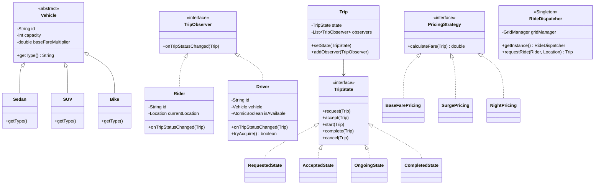

# Ride-Sharing Simulation Engine

A pure Java SE application demonstrating a simulation of a ride-sharing service, built to exhibit strong OOP design and system design fundamentals, without relying on external libraries or frameworks (except JUnit for testing).

## Architecture

The system is designed with clean architecture and SOLID principles in mind. It uses a spatial grid to efficiently match riders with drivers and simulates concurrent requests using a thread pool.

### Class Diagram



## Design Patterns Used & Rationale

1. **Factory Pattern (`VehicleFactory`)**
   - **Where it lives**: `com.rideshare.pattern.factory`
   - **Rationale**: Encapsulates object creation logic, ensuring that adding new vehicle types (e.g., Luxury) doesn't require modifying client code (Open/Closed Principle).

2. **Strategy Pattern (`PricingStrategy`)**
   - **Where it lives**: `com.rideshare.pattern.strategy`
   - **Rationale**: Allows dynamically switching the fare calculation algorithm (Base, Surge, Night) at runtime without cluttering the `Trip` or `RideDispatcher` with complex `if/else` statements.

3. **Observer Pattern (`TripObserver`)**
   - **Where it lives**: `com.rideshare.pattern.observer`
   - **Rationale**: Decouples the `Trip` class from specific entity classes like `Rider` and `Driver`, allowing them to be automatically notified of status changes without tight coupling.

4. **State Pattern (`TripState`)**
   - **Where it lives**: `com.rideshare.pattern.state`
   - **Rationale**: Models the complex lifecycle of a trip cleanly. It prevents illegal state transitions (e.g., jumping from `COMPLETED` back to `ONGOING`) by delegating behavior to specific state classes rather than using massive `switch` blocks.

5. **Singleton Pattern (`RideDispatcher`)**
   - **Where it lives**: `com.rideshare.service`
   - **Rationale**: Acts as the central, thread-safe coordinator for the entire system, ensuring all ride requests are managed against a single, consistent pool of drivers (implemented using double-checked locking).

## Concurrency Handling

The simulation leverages Java's `ExecutorService` to emulate multiple ride requests arriving concurrently. To ensure safe execution and prevent double-booking:
- **`AtomicBoolean` in `Driver`**: The driver's availability is tracked using an atomic boolean. The `tryAcquire()` method uses `compareAndSet(true, false)` to guarantee that only one thread can successfully book a driver, effectively eliminating race conditions.
- **Thread-safe Metrics**: Counters for completed trips and total revenue in `RideDispatcher` use `AtomicInteger` and `AtomicReference` respectively.

## How to Run

### Prerequisites
- JDK 17 or higher
- Maven (optional, but recommended for tests)

### Running the Simulation
Navigate to the root directory (`ride-share-engine`) and compile the classes:
```bash
# Using standard Java compilation
javac -d out $(find src/main/java -name "*.java")

# Run the simulation
java -cp out com.rideshare.Main
```

### Running Tests
If you have Maven installed, you can run the JUnit test suite:
```bash
mvn clean test
```
